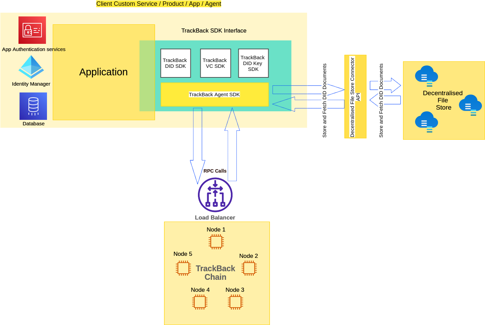

[](https://trustalliance.co.nz/)

[](https://github.com/trustalliance-blockchain/trustalliance-verifiable/tree/main/packages/trustalliance-vc)
[](https://github.com/trustalliance-blockchain/trustalliance-verifiable/tree/main/packages/trustalliance-key)
[](https://github.com/trustalliance-blockchain/trustalliance-verifiable/tree/main/packages/trustalliance-did)
[](https://github.com/trustalliance-blockchain/trustalliance-verifiable/tree/main/packages/trustalliance-agent)

[](https://github.com/trustalliance-blockchain/trustalliance-verifiable/tree/main/packages)
[](https://nodejs.org/es/blog/release/v14.0.0)
[](https://lerna.js.org/)

## SDKs for Verifiable Credentials, Verifiable Credential Presentations, DID Keys, Self Sovereign Identity and Decentralised Identifiers

## IMPORTANT! 
* This is a minimum viable product suite with limited functionality.
* Please do not use this for production

## Prerequisites
* BuildScripts 
* Working with NodeJS 14.0.0 + in either Linux or Windows

## The Big Picture ( MVP Release )


## Mono repo packages
Please go through the individual repositories 
* [trustalliance-agent](./packages/trustalliance-agent)
* [trustalliance-did](./packages/trustalliance-did)
* [trustalliance-key](./packages/trustalliance-key)
* [trustalliance-vc](./packages/trustalliance-vc)


### Setup project.
```bash
nvm use 14
npm install lerna
npm install bootstrap
yarn config set workspaces-experimental true
npm run bootstrap
```

### Tests
To run all tests for the project

```bash
npm run test
```

### Builder

```bash
npm run build
```

### Clean and rebuild
```bash
find . -name 'node_modules' -type d -prune -exec rm -rf '{}' +
yarn install
```
### Generate documentation
```bash
sudo npm i -g typedoc # needs to do only once
typedoc --darkHighlightTheme dark-plus --tsconfig ./tsconfig.json
```